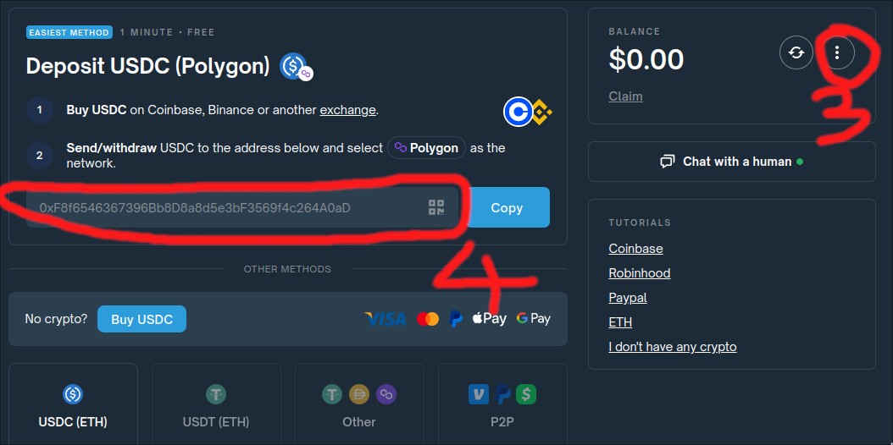

# Quick [polymarket](https://polymarket.com/) [api](https://docs.polymarket.com) setup tutorial 

This tutorial shows how to set up a Polymarket account to use its [CLOB API](https://docs.polymarket.com/#clob-api) using Python.

## Part 1 - Set Up Polymarket Account

1. Create polymarket account using non-wallet method (e.g. email). If you choose wallet method, you need to setup [allowances](https://docs.polymarket.com/#allowances).
2. Deposit funds and place one trade.
3. Export your private key (see [how to export private key](https://learn.polymarket.com/how-to-export-private-key))
4. Get the "funder" address, which is the same as USDC deposit address.

 

## Part 2 - Python

1. To get markets and events you can use [Gamma Markets API](https://docs.polymarket.com/#gamma-markets-api) :
```python
import requests
markets = requests.get("https://gamma-api.polymarket.com/markets")
print(markets.json())
```
and
```python
import requests
import json
events = requests.get("https://gamma-api.polymarket.com/events")

json_data = json.dumps(events.json(), indent=4)
with open("events.json", "w") as file:
    file.write(json_data)
print("Data formatted and saved to events.json, look for clobTokenIds later in this tutorial")
```
2. Install [py-clob-client](https://github.com/Polymarket/py-clob-client): `pip install py-clob-client`

3. Authentication
```python
from py_clob_client.client import ClobClient
from py_clob_client.clob_types import OrderArgs
from py_clob_client.constants import POLYGON
from py_clob_client.order_builder.constants import BUY

HOST = "https://clob.polymarket.com"
CHAIN_ID = POLYGON
# Private key we exported from polymarket UI
KEY = "0xxxxxxxxxxxxxxxxxxxxxxxxxxxxxxxxxxxxxxxxxxxxxxx"
# Funder we got from polymarket UI
FUNDER = "0xxxxxxxxxxxxxxxxxxxxxxxxxxxxxxxxxx"

# Create CLOB client and get/set API credentials
client = ClobClient(
    HOST,
    key=KEY,
    chain_id=CHAIN_ID,
    funder=FUNDER,
    signature_type=1,
)
client.set_api_creds(client.create_or_derive_api_creds())
```

4. See your current orders
```python
print(client.get_orders())
```

5. Place order

price = we offer 0.10$ to win $1
size = we do that 10x, so $1 to win $10
side = BUY or SELL, imported from `py_clob_client.order_builder.constants` 
token_id = You can find these from `events.json` if you followed these steps. These are named as `clobTokenIds`.
```python
resp = client.create_and_post_order(
    OrderArgs(
        price=0.10,
        size=10.0,
        side=BUY,
        token_id="34731657770883441140875001518098751138877095477683682718012432921110142479972", # from events.json
    )
)
print(resp)
```

6. List orders and cancel all orders
```python
print(client.get_orders())
print("-"*25)
print(client.cancel_all())
print("-"*25)
print(client.get_orders())
```
